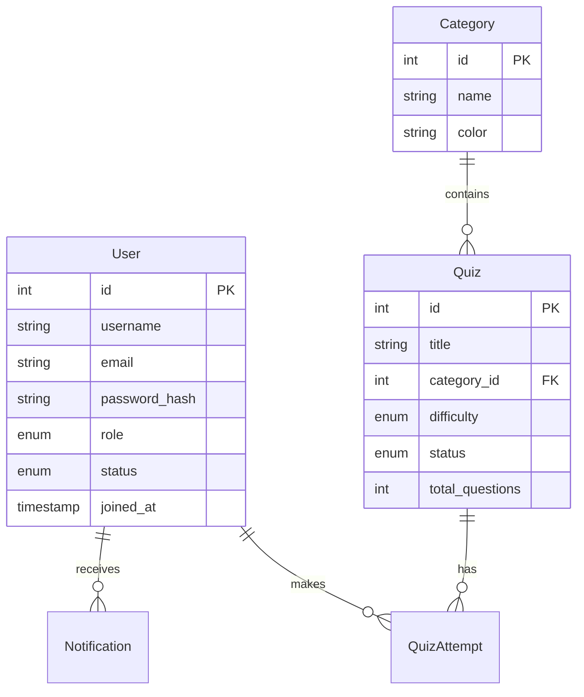

# 🛠️ Backend Implementation Guide

This document defines the backend architecture, database schema, and API structure required for the **DevQuiz Admin Dashboard**.

---

## 📚 Table of Contents

1. [Tech Stack](#-recommended-tech-stack)
2. [Database Schema](#-database-schema)
3. [API Specification](#-api-specification)
4. [Functional Requirements](#-functional-requirements)

---

## 💻 Recommended Tech Stack

To build a scalable and maintainable backend, we recommend the following technologies:

| Category       | Technology         | Purpose                                        |
| :------------- | :----------------- | :--------------------------------------------- |
| **Runtime**    | **Node.js** (v18+) | JavaScript runtime environment                 |
| **Framework**  | **Express.js**     | Fast, minimalist web framework                 |
| **Language**   | **TypeScript**     | Static typing for better maintainability       |
| **Database**   | **PostgreSQL**     | Relational database for structured consistency |
| **ORM**        | **Prisma**         | Modern ORM for type-safe database access       |
| **Auth**       | **JWT + bcrypt**   | Token-based auth & password hashing            |
| **Validation** | **Zod**            | Runtime schema validation                      |

---

## 🗄️ Database Schema

### 🧩 Entity Relationship Diagram



### 1. Users Table

_Manage administrative and regular user accounts._

| Column          | Type     | Nullable | Default    | Description                             |
| :-------------- | :------- | :------- | :--------- | :-------------------------------------- |
| `id`            | UUID     | No       | -          | Primary Key                             |
| `username`      | String   | No       | -          | Unique username                         |
| `email`         | String   | No       | -          | Unique email address                    |
| `password_hash` | String   | No       | -          | Bcrypt hashed password                  |
| `role`          | Enum     | No       | `'User'`   | `'Admin'`, `'Moderator'`, `'User'`      |
| `status`        | Enum     | No       | `'Active'` | `'Active'`, `'Inactive'`, `'Suspended'` |
| `avatar_url`    | String   | Yes      | `null`     | Profile image URL                       |
| `created_at`    | DateTime | No       | `now()`    | Registration timestamp                  |

### 2. Quizzes Table

_Stores quiz metadata and configuration._

| Column        | Type     | Nullable | Default   | Description                                  |
| :------------ | :------- | :------- | :-------- | :------------------------------------------- |
| `id`          | UUID     | No       | -         | Primary Key                                  |
| `title`       | String   | No       | -         | Quiz Title                                   |
| `category_id` | Int      | No       | -         | Foreign Key -> `Services`                    |
| `difficulty`  | Enum     | No       | -         | `'Beginner'`, `'Intermediate'`, `'Advanced'` |
| `status`      | Enum     | No       | `'Draft'` | `'Published'`, `'Draft'`, `'Archived'`       |
| `pass_rate`   | Float    | No       | `0.0`     | Calculated pass percentage                   |
| `updated_at`  | DateTime | No       | `now()`   | Last modified timestamp                      |

---

## 🔌 API Specification

All API endpoints should follow **RESTful** principles and return JSON responses.

### 🔐 Authentication

| Method | Endpoint             | Description                          |
| :----- | :------------------- | :----------------------------------- |
| `POST` | `/api/auth/login`    | Authenticate user & return **JWT**   |
| `POST` | `/api/auth/register` | Register a new user account          |
| `GET`  | `/api/auth/me`       | Get current user profile (Protected) |

### 👥 User Management

| Method   | Endpoint         | Description       | Query Params                |
| :------- | :--------------- | :---------------- | :-------------------------- |
| `GET`    | `/api/users`     | List users        | `?page=1&limit=10&q=search` |
| `GET`    | `/api/users/:id` | Get user details  | -                           |
| `POST`   | `/api/users`     | Create user       | -                           |
| `PUT`    | `/api/users/:id` | Update user       | -                           |
| `DELETE` | `/api/users/:id` | Check soft-delete | -                           |

### 📝 Quiz Management

| Method  | Endpoint                  | Description      | Query Params                      |
| :------ | :------------------------ | :--------------- | :-------------------------------- |
| `GET`   | `/api/quizzes`            | List quizzes     | `?status=Published&diff=Beginner` |
| `GET`   | `/api/quizzes/:id`        | Get single quiz  | -                                 |
| `POST`  | `/api/quizzes`            | Creates new quiz | -                                 |
| `PATCH` | `/api/quizzes/:id/status` | Update status    | -                                 |

### 📊 Dashboard Statistics

| Method | Endpoint                 | Description                                  |
| :----- | :----------------------- | :------------------------------------------- |
| `GET`  | `/api/stats/overview`    | Returns aggregate counts for dashboard cards |
| `GET`  | `/api/stats/performance` | Returns chart data (attempts over time)      |

---

## ⚙️ Functional Requirements

1.  **Pagination**: All list endpoints **must** support pagination meta-data:
    ```json
    {
      "data": [...],
      "meta": {
        "page": 1,
        "limit": 10,
        "total": 50,
        "totalPages": 5
      }
    }
    ```
2.  **Search & Filtering**:
    - **Users**: Search by `username` or `email` (case-insensitive).
    - **Quizzes**: Filter by `status` or `difficulty`.
3.  **Error Handling**:
    - Return consistent error structures: `{ "error": "Message", "code": "ERROR_CODE" }`.
    - Use status `400` for validation errors and `401`/`403` for auth errors.
